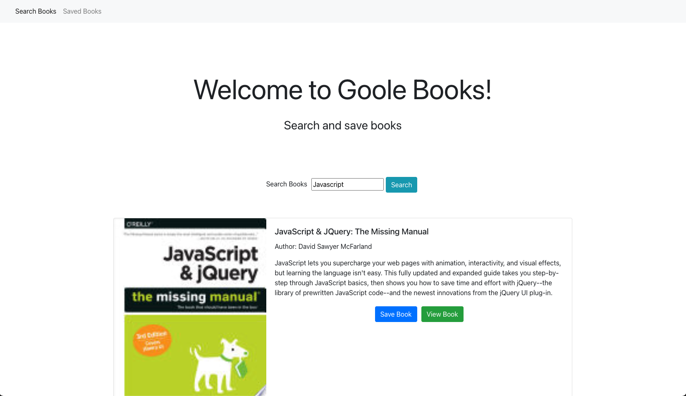

# Google-Book-Search

<!-- https://www.youtube.com/watch?v=6sBqMyUOcl8&t=335s -->
## Google Books Search 

## Table of Contents
- [Description](#description)
- [Technologies](Technologies)
- [Usage](#usage)
- [License](#license)
- [Contributing](#contributing)
- [Tests](#tests)
- [Questions](#questions)

## Description
 This is a book search app created using React. You can also save books that you are interested in. Uses React components, work with helper/util functions, and utilize React lifecycle methods to query and display books based on user searches. You'll also use Node, Express and MongoDB so that users can save books to review or purchase later.

## Technologies
React Bootstrap Express Mongoose React-Bootstrap React-Router

## Usage
Great for general interest in book searches or purchases

project specifics.

 
## License
ISC
## Contributing
[Alexandra Hionis](https://github.com/Alexandra-Hionis/README-Generator)

Helpful video to display google books api data and render it into my components
https://www.youtube.com/watch?v=nT6Ud9nUzXU&t=265s
## Tests
No tests were used
## Questions
GitHub: https://github.com/Alexandra-Hionis  
Email: Alexandra.hionis@gmail.com  

 
